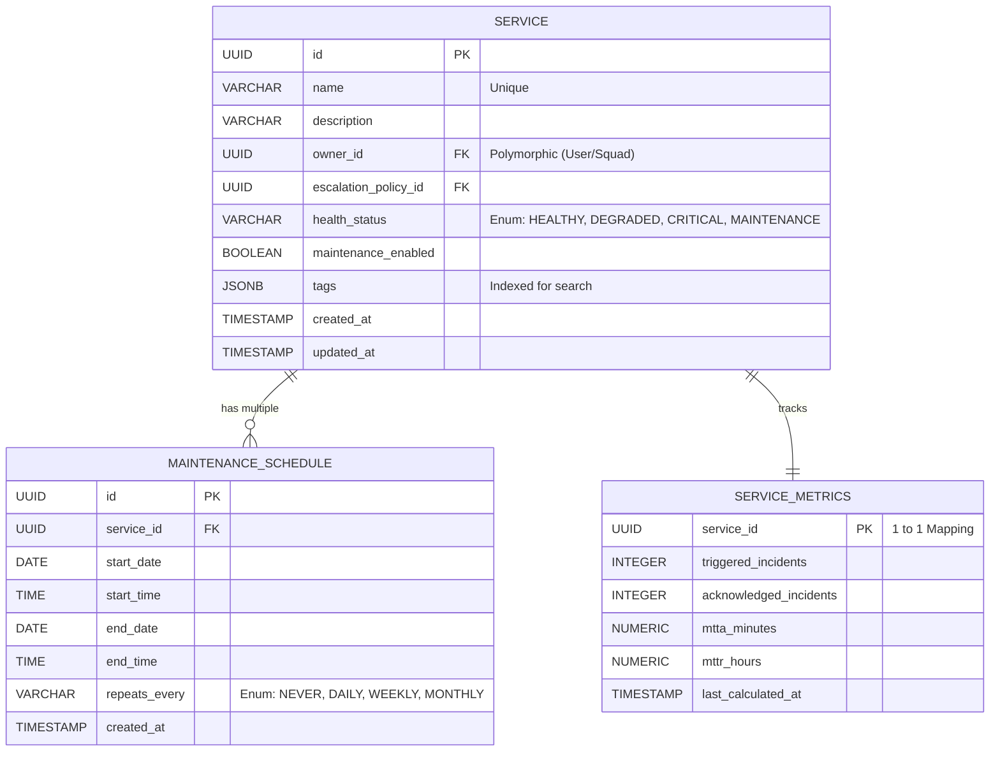

# Services Management - Backend Architecture & Database Design

This document outlines the Java Spring Boot architecture, database schema, and strategies for handling the critical technical aspects of the Services Management module.

## 1. High-Level Spring Boot Architecture

Following the `JavaBackendArchitect` guidelines, the module will be structured using standard DDD (Domain-Driven Design) layering:

*   **Controllers (`ServiceController`)**: Exposes REST endpoints cleanly mirroring `services-api-spec.yaml`. Validates requests using Jakarta standard annotations (`@Valid`, `@NotNull`).
*   **Services (`ServiceManagementImpl`)**: Contains pure business logic. Handles transactional boundaries, maintenance schedule overlap resolution, and tag indexing logic.
*   **Repositories (`ServiceRepository`, `MaintenanceScheduleRepository`)**: Spring Data JPA interfaces handling persistent storage and execution of dynamic filters (e.g., using JPA Specifications for complex Service searches by tags or owners).
*   **DTOs & Mappers**: Request/Response models mapped bidirectionally to Entities using **MapStruct** to prevent exposing internal DB schemas.
*   **Schedulers (`MaintenanceStatusScheduler`)**: A background worker executing periodic logic (like evaluating if "Repeats Weekly" maintenance windows should trigger).

---

## 2. Database Schema (Entity Relationships)

We will use a relational database (e.g., PostgreSQL) utilizing JPA annotations.

### Mermaid Entity Relationship Diagram (ERD)

### Key JPA Entity Specifications

#### 1. `ServiceEntity`
*   **Table Name**: `services`
*   **Relationships**:
    *   `@OneToMany(mappedBy = "service", cascade = CascadeType.ALL, orphanRemoval = true)` to `MaintenanceScheduleEntity`.
    *   `@OneToOne(mappedBy = "service", cascade = CascadeType.ALL)` to `ServiceMetricsEntity`.
*   **Tags**: Using PostgreSQL's `JSONB` for `tags` to allow flexible, high-performance Key/Value searching without normalized join tables. (e.g., mapping via Hibernate Types `@Type(JsonBinaryType.class)`).

#### 2. `MaintenanceScheduleEntity`
*   **Table Name**: `maintenance_schedules`
*   **Validations**: Class-level constraint validation to ensure `end_date` is not before `start_date`.

#### 3. `ServiceMetricsEntity`
*   **Table Name**: `service_metrics`
*   **Design**: Decoupled from the main `ServiceEntity` via `@OneToOne`. This ensures that heavy read/write operations to update metrics during chaotic incident storms do not lock the primary `Service` row.

---

## 3. Resolving Critical Technical Aspects

### A. Maintenance Mode Scheduling & Recurrence Logic (Concurrency)
*   **Storage**: Schedules are stored declaratively (e.g., `start_date`, `repeats_every`).
*   **Evaluation Engine**: We will implement a `MaintenanceEvaluationService`. Instead of creating infinite records for recurring events, the incident routing engine will query this service: `isServiceInMaintenance(serviceId, currentTimestamp)`. The service evaluates the stored cron-like logic in memory against the current time.
*   **State Alignment**: If a scheduled window becomes active, a Spring `@Scheduled` background task (running e.g., every 1 minute) will flip the `health_status` column of the `ServiceEntity` to `MAINTENANCE` and dispatch a `ServiceStatusChangedEvent` to alert other modules.

### B. High-Performance Metrics Calculation (MTTA/MTTR)
*   **Event-Driven Aggregation**: We will NOT calculate MTTA/MTTR via aggregate SQL queries on the fly when the `/services` list API is hit.
*   **Logic**: When an incident moves to `RESOLVED`, an event is fired (`IncidentResolvedEvent`). An asynchronous listener in the Service module catches this, recalculates the rolling 30-day average for that specific service, and updates the `SERVICE_METRICS` table.
*   **Result**: The `/services` GET endpoint remains blazingly fast because it just performs a simple `JOIN` fetch against pre-calculated numbers.

### C. Service Health State Machine
*   The `health_status` is inherently derived from Incident module data.
*   We will employ an **Event-Driven Architecture**. The `ServiceEntity` listens to state changes on Incidents attached to its ID. If an open `P1` incident hits, the service transitions to `CRITICAL`. If the service is in a designated `MaintenanceSchedule`, those incoming triggers are suppressed.

### D. Multi-Entity Relationships
*   `ownerId` and `escalationPolicyId` will be stored as simple `UUID` foreign keys. We assume the system utilizes microservices or loosely coupled domains. The frontend or an API Gateway (BFF - Backend For Frontend) is responsible for resolving the `name` and `avatar` of the User/Squad by making parallel calls to an IAM/Directory service if needed, keeping domain boundaries clean.
